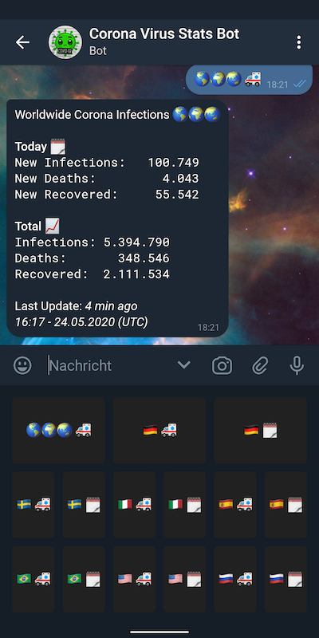

# Corona Virus Stats Bot

A bot for the Telegram messenger to provide current statistics on the corona virus outbreak.

## Getting Started

Just say hi to [@CoronananaVirusBot](https://t.me/CoronananaVirusBot) via Telegram. 👋

## Screenshots

Action Buttons | Charts | Stats 
:-:|:-:|:-:
  |    |  

## Setup

Head over to https://github.com/davtur19/TuriBot

## Built With

* [TuriBot](https://github.com/davtur19/TuriBot) - A good source for Telegram bots
* [covid19api.com](https://covid19api.com/) - A free API for data on the Coronavirus
* [Telegram](https://telegram.org/) - Telegram Messenger

## License

This project is licensed under the GNU GPL v3 License - see the [LICENSE](LICENSE) file for details
